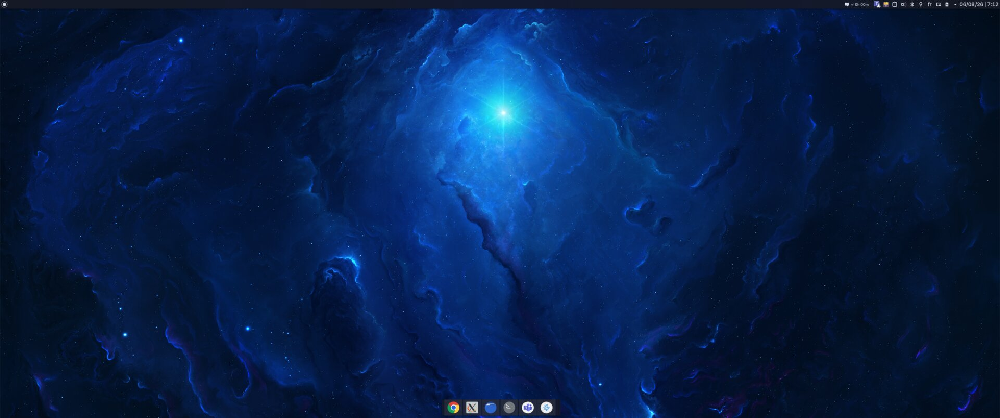

# Debianedara

An elegant KDE Plasma 6 theme with a deep-space identity, built for
**Debian 13 (trixie) + Plasma 6.3** — light and dark variants, a luminous
nebula-blue accent, and an optional macOS-like layout.

[](assets/desktop-example.png)

*Dark mode with the macOS-like layout: thin top bar, centered floating dock —
click for full resolution.*

## What you get

- **Two color schemes** — *Debianedara Dark* (deep-space navy, `#0B0E17`–`#10131E`)
  and *Debianedara Light* (cool paper whites), both accented with nebula blue
- **Two global themes** (Look and Feel packages) selectable in System Settings
- **Your choice of application style** — Kvantum (with matching Debianedara
  widget themes, flat & modern with blurred translucent menus, derived from
  KvFlat at install time), Breeze, Fusion, or anything else installed;
  `debianedara-style` lists and switches it afterwards
- **A choice of wallpaper** — the deep-space nebula
  ([wallhaven](https://wallhaven.cc/w/mlgmjm)), a light/dark pair of soft
  *aurora* gradients that follows the mode, or your own image
- **Matching lock screen** — it follows the desktop wallpaper per mode by
  default, or takes an image of its own
- **Inter** as the system font
- **Optional macOS-like layout** — thin translucent top bar (app launcher,
  global menu, system tray, clock) + centered floating dock, window buttons
  on the left in macOS order
- **Optional day/night cycle** — light 07:00–19:00, dark otherwise, driven by
  a systemd user timer; switches colors, icons, Kvantum theme, wallpaper, lock
  screen and Konsole profile in one go
- **One file to retune it all** — `~/.config/debianedara/theme.conf` holds what
  each mode applies, so light and dark can be changed without reinstalling
- **Tela-circle icons** (optional, cloned from the
  [official repo](https://github.com/vinceliuice/Tela-circle-icon-theme))
- A KWin rule that hides the
  [Xwayland Video Bridge ghost window](https://bugs.kde.org/show_bug.cgi?id=473946)
  (the 1×1 px artifact visible at the screen edge)
- **Optional Konsole themes** — the [Dracula](https://draculatheme.com) family
  with the Hack font: *Dracula* (the original), *Dracula Storm* (a softer dark)
  and *Dracula Light*, built on [Alucard](https://draculatheme.com/alucard) with
  a warm cream background instead of white so it stays easy on the eyes. Pick
  the default profile, or let it follow light/dark mode
- **Optional `ls` color fix** — GNU `ls` paints other-writable directories on a
  green background and setuid files on red; a terminal has one palette for text
  and backgrounds, so those come out as unreadable blocks in any light theme.
  The installer can write a `dircolors` file that keeps the distinctions in the
  foreground color instead
- **Optional editor theme** — the official
  [Dracula extension](https://marketplace.visualstudio.com/items?itemName=dracula-theme.theme-dracula)
  installed into VS Code and/or VSCodium when detected

## Install

```sh
bash <(curl -sL https://raw.githubusercontent.com/Nedara-Project/debianedara/main/install.sh)
```

Run as your normal user — `sudo` is only invoked for `apt`. The script asks a
few questions (wallpaper, lock screen, application style, icons, layout, cycle,
Konsole theme, initial mode); every answer can be preseeded for a
non-interactive install:

```sh
WALLPAPER=aurora LOCKSCREEN=follow STYLE=kvantum ICONS=yes BUTTONS_LEFT=yes \
MACOS_LAYOUT=yes HIDE_XWVB=yes CYCLE=no KONSOLE=auto DIRCOLORS=yes \
MODE=dark bash install.sh
```

| Variable       | Values                          | Default  | What it does                                  |
|----------------|---------------------------------|----------|-----------------------------------------------|
| `WALLPAPER`    | `space` / `aurora` / path/URL / `skip` | `space` | Desktop wallpaper: `space` = the nebula in both modes, `aurora` = a light/dark gradient pair that follows the mode (`nebula` still works as the old name for `space`) |
| `LOCKSCREEN`   | `follow` / path/URL / `skip`    | `follow` | Lock screen wallpaper — `follow` mirrors the desktop, per mode |
| `STYLE`        | `kvantum` / `breeze` / `fusion` / any installed style | `kvantum` | Application style. Only `kvantum` pulls in the Kvantum packages and builds the matching widget themes |
| `ICONS`        | `yes` / `no`                    | `yes`    | Install Tela-circle icon themes                |
| `BUTTONS_LEFT` | `yes` / `no`                    | `yes`    | Window buttons on the left (close/min/max)     |
| `MACOS_LAYOUT` | `yes` / `no`                    | `yes`    | Top bar + centered floating dock               |
| `HIDE_XWVB`    | `yes` / `no`                    | `yes`    | Hide the Xwayland Video Bridge ghost window    |
| `CYCLE`        | `yes` / `no`                    | `no`     | Automatic day/night switching                  |
| `KONSOLE`      | `dark` / `light` / `storm` / `auto` / `no` | `dark` | Which Dracula profile Konsole opens with; `auto` follows the mode. All three schemes are installed unless `no` (`yes` still works as the old name for `dark`) |
| `DIRCOLORS`    | `yes` / `no`                    | `yes`    | Write a `dircolors` file without background fills, and source it from `~/.bashrc` |
| `CLIPBOARD`    | `yes` / `no`                    | `yes`    | Keep the [Klipper](https://userbase.kde.org/Klipper) clipboard manager in the tray |
| `DRACULA`      | `yes` / `no`                    | `yes`*   | Dracula extension for VS Code/VSCodium         |
| `CLOCK_SIZE`   | `8`–`24` or `auto`              | `15`†    | Top bar clock font size (one-line date+time)   |
| `CLOCK_DATE`   | `macos` / `locale` / `eu` / `iso` / custom| `macos`†| Clock date format (`macos` = `Mon Apr 1`, ordered to match the locale; `eu` = dd/MM/yy; custom = any [Qt format](https://doc.qt.io/qt-6/qdate.html#toString)) |
| `CLOCK_24H`    | `yes` / `locale`                | `locale`†| Force 24-hour time on the clock                |
| `MODE`         | `dark` / `light` / `auto`       | `dark`   | Mode applied at the end of the install         |
| `OVERWRITE`    | `yes` / `no`                    | `no`     | `yes` reinstalls from scratch, discarding local edits to generated files (see [Updating](#updating)) |

\* only offered when `code` or `codium` is found on the machine.
† only asked/applied with `MACOS_LAYOUT=yes` (they configure the top bar clock).

Log out and back in afterwards so every application picks up the fonts and
application style.

## Daily use

```sh
debianedara-mode dark     # switch to dark
debianedara-mode light    # switch to light
debianedara-mode auto     # pick by time of day (light 07:00-19:00)

debianedara-style         # list the application styles found on this machine
debianedara-style breeze  # apply one

systemctl --user enable --now debianedara.timer    # turn the cycle on
systemctl --user disable --now debianedara.timer   # turn it off
```

### Updating

Re-run the installer. It updates in place and **keeps whatever you changed**:

```sh
bash <(curl -sL https://raw.githubusercontent.com/Nedara-Project/debianedara/main/install.sh)
```

- Every generated file's checksum is recorded in
  `~/.config/debianedara/manifest.sha256`. A file that still matches is
  refreshed; one you have edited since is **left alone**, and the new version
  is written beside it as `<file>.new`. The run ends with the list, so you can
  `diff` at your leisure.
- Your answers are remembered in `~/.config/debianedara/install.conf` and
  become the defaults of the next run — updating is Enter, Enter, Enter.
- Wallpapers already on disk are kept instead of re-downloaded (14 MB saved,
  and an image you swapped in by hand survives).
- The panel layout is applied **once**: a second pass would strip whatever you
  have since added to the dock. The `…debianedara-backup` of your original
  layout is never overwritten either.
- Kvantum themes with local edits are kept as they are.

To throw all of that away and reinstall from scratch:

```sh
OVERWRITE=yes bash install.sh
```

Things that are always reapplied, since they are single settings rather than
files: the Inter fonts, the window button order, the KWin rule, and the clock
appearance. Answer `no` to the matching question (or set e.g. `BUTTONS_LEFT=no`)
if you have tuned those by hand.

### Retuning a mode

`~/.config/debianedara/theme.conf` is the single place that decides what light
and dark actually apply — no reinstall needed:

```ini
STYLE="kvantum"
SCHEME_LIGHT="DebianedaraLight"   # ~/.local/share/color-schemes/*.colors
SCHEME_DARK="DebianedaraDark"
KVANTUM_LIGHT="DebianedaraLight"  # ~/.config/Kvantum/*/, only used with STYLE=kvantum
KVANTUM_DARK="DebianedaraDark"
ICONS_LIGHT="Tela-circle"
ICONS_DARK="Tela-circle-dark"
WALL_LIGHT="/home/you/.local/share/wallpapers/debianedara-aurora-light.jpg"
WALL_DARK="/home/you/.local/share/wallpapers/debianedara-aurora-dark.jpg"
LOCK_LIGHT="…"                    # lock screen, same as the desktop by default
LOCK_DARK="…"
KONSOLE_LIGHT="Dracula Light"     # ~/.local/share/konsole/*.profile
KONSOLE_DARK="Dracula"
```

An empty value means *leave that setting alone*. Reapply the mode you are
already in with:

```sh
FORCE=1 debianedara-mode dark
```

## Uninstall

```sh
systemctl --user disable --now debianedara.timer 2>/dev/null
rm -rf ~/.local/share/color-schemes/Debianedara*.colors \
       ~/.local/share/plasma/look-and-feel/org.debianedara.* \
       ~/.config/Kvantum/Debianedara* \
       ~/.local/share/wallpapers/debianedara-* \
       ~/.local/share/konsole/Dracula* \
       ~/.local/bin/debianedara-mode ~/.local/bin/debianedara-style \
       ~/.config/debianedara \
       ~/.config/systemd/user/debianedara.* \
       ~/.config/autostart/debianedara.desktop
# and drop the "Debianedara ls colors" block from ~/.bashrc if it is there
# then pick another Global Theme in System Settings, and restore the panel
# layout backup if you applied the macOS layout:
#   cp ~/.config/plasma-org.kde.plasma.desktop-appletsrc.debianedara-backup \
#      ~/.config/plasma-org.kde.plasma.desktop-appletsrc
#   systemctl --user restart plasma-plasmashell
```

## Notes

- Plasma 6.3 has no native day/night theme switching (it landed in 6.4),
  which is why the cycle is a systemd user timer.
- Kvantum window translucency does not work on Wayland; this theme keeps
  windows opaque and only makes menus/popups translucent (which does work).
- The global menu in the top bar only fills in for applications that export
  their menu (KDE/Qt apps do; Chrome, Electron and most GTK apps do not).
- A terminal has a single 16-color palette serving both text and backgrounds,
  so a light theme cannot make `OTHER_WRITABLE 34;42` (blue on green) readable:
  a green dark enough to read as text is a bad background, and vice versa.
  `DIRCOLORS=yes` fixes it at the source instead. Colors over SSH come from the
  *remote* host, so copy the file there too:
  ```sh
  scp ~/.config/debianedara/dircolors user@host:~/.dircolors
  # then in the remote ~/.bashrc:  eval "$(dircolors -b ~/.dircolors)"
  ```
## Credits

- **Nebula wallpaper**: mirrored in [`assets/`](assets/) so the theme keeps
  working if the source goes away — original found on
  [wallhaven (mlgmjm)](https://wallhaven.cc/w/mlgmjm); all rights remain with
  its author, see the source page for details. The *aurora* gradients are
  generated artwork, MIT like the rest of this repository.
- **[Dracula](https://draculatheme.com)** Konsole schemes and editor extension —
  MIT licensed, by Zeno Rocha and contributors. *Dracula Light* uses the accent
  colors of [Alucard](https://draculatheme.com/alucard), Dracula's official
  light theme, on a slightly dimmed cream background.
- **[Tela-circle icons](https://github.com/vinceliuice/Tela-circle-icon-theme)**
  by vinceliuice, cloned from the official repository at install time.
- **[Kvantum](https://github.com/tsujan/Kvantum)** by Tsu Jan — the Debianedara
  widget themes are generated locally from its KvFlat/KvFlatLight themes.

## License

MIT — see [LICENSE](LICENSE). The Kvantum themes are generated locally from
KvFlat/KvFlatLight (part of the GPL-licensed
[Kvantum](https://github.com/tsujan/Kvantum) themes package) and are not
redistributed here.
